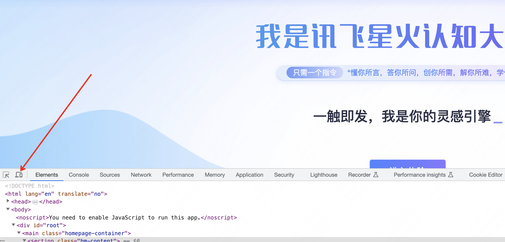
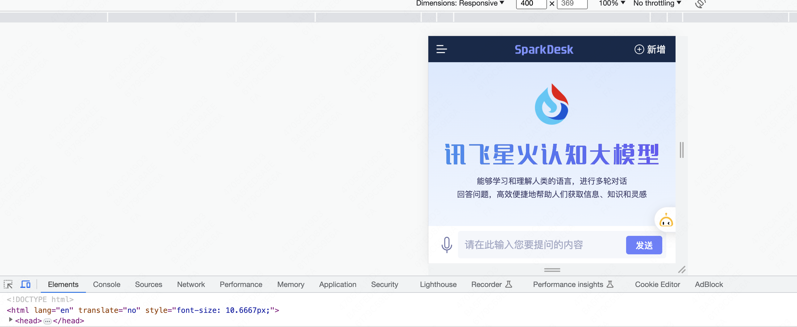
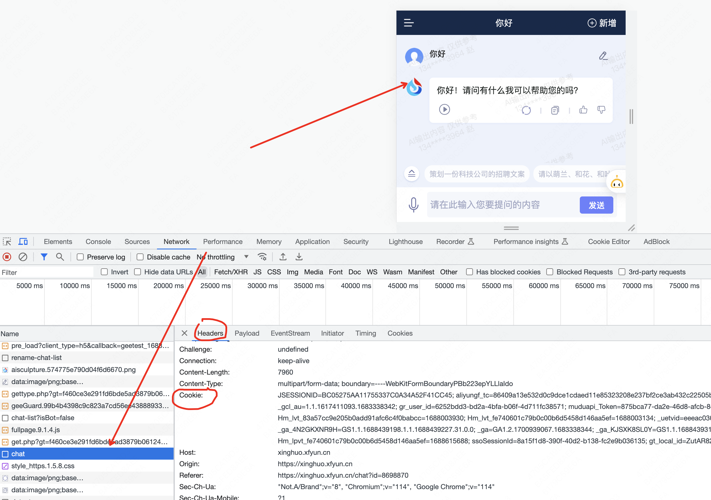

# sparkdesk-api 讯飞星火大模型api
> 如果该项目对你有帮助，不要忘记给我点个 star 哦！
## 使用方法
```shell
pip install sparkdesk-api==1.0.1
```

### 1. Web模式
Web模式下，需要前往讯飞星火大模型web端通过 F12 抓取 3 个参数：cookie、fd、GtToken
讯飞星火的web端有防护，在web端直接按 F12 不能打开开发者窗口。但是可以通过特殊方法打开：
1. 进入 [https://xinghuo.xfyun.cn/](https://xinghuo.xfyun.cn/) 后登录账号，不要立即点“进入体验”，而是在这个页面点击 F12
2. 进入 F12 开发者窗口后，将网页修改为“手机端”窗口
    1. 
3. 在第二步完成后，才点击“进入体验”，进入讯飞星火的web端，可以发现成功变成手机端
    1. 
4. 先发一条简单的语句，让讯飞回复一段话，然后在“Network”栏目找到 “chat” 请求，在该请求下抓取 3 个参数
    1. 
    2. 
5. 获取后，即可开始使用 Web 模式

#### 命令后模式
```shell
python sparkdesk_web_cli.py
```

#### api调用
- chat()：一次询问
- chat_stream()：连续询问，相当于命令行模式
```python
sparkWeb = SparkWeb(
     cookie=cookie,
     fd=fd,
     GtToken=GtToken
 )

 # single chat
 print(sparkWeb.chat("repeat: hello world"))
 # continue chat
 sparkWeb.chat_stream()
```

### 2. API模式
讯飞星火的API需要前往官网进行申请。
你可以先创建一个服务，然后在该服务的控制台页面左边的：“星火认知大模型”栏目，进入“合作咨询”页面进行申请。
一般使用公司邮箱申请速度快。

该模式需要 3 个参数：app_id、api_key、api_secret

具体调用方法与相关调用函数与 Web 模式一致。
